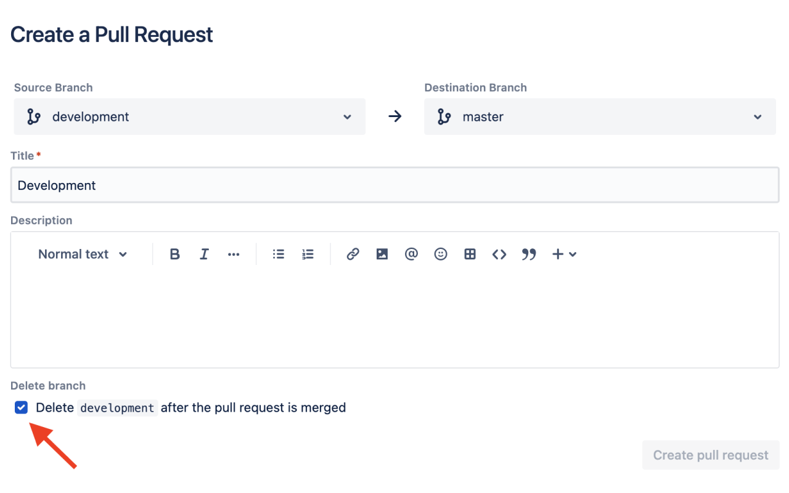

  

  <h1 align="center">Bitbucket Pull Request auto delete branch</h1>

  <h4 align="center">Automatically checks the checkbox to delete the current branch after the pull request is merged on Bitbucket Cloud</h4>

  

    <a href="https://chrome.google.com/webstore/detail/bitbucket-pull-request-au/iffllgmebelmfdfiiagjgbpjhplobfem?utm_source=github"><strong>Install for Google Chrome &raquo;</strong></a>
  

  
  

  

## Requirements

- [Git](https://git-scm.com/)
- [NodeJS](https://nodejs.org/)

## Getting Started

1. Clone the repository `git clone https://github.com/hmartos/bitbucket-pull-request-auto-delete-branch.git`.
2. Open Google Chrome Extension Management page navigating to [chrome://extensions](chrome://extensions).
   The Extension Management page can also be opened by clicking on the Chrome menu, hovering over `More Tools` then selecting `Extensions`.
3. Enable `Developer Mode` by clicking the toggle switch next to Developer mode in the top right corner.
4. Click the `Load Unpacked` button and select the folder `src` inside the cloned repository.

## Build

You can generate a zip file with the extension ready to be uploaded to [Google Chrome Developer Dashboard](https://chrome.google.com/webstore/devconsole)

Just execute `npm run build` and a zip called `bitbucket-pull-request-auto-delete-branch.zip` will be generated.

## License

Copyright 2023 Héctor Martos. Code released under the [MIT License](./LICENSE).
